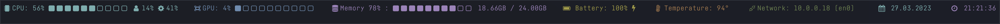

statusbar
=========

[](https://github.com/macmade/statusbar/actions/workflows/ci-mac.yaml)
[](https://github.com/macmade/statusbar/issues)

  
[](https://twitter.com/macmade)
[](https://github.com/sponsors/macmade)

### About

Statusbar for your terminal:



```
Usage: statusbar [OPTIONS]

Options:

    --help                 Shows the help dialog
    --cpu                  Displays CPU load
    --memory               Displays memory usage
    --temperature          Displays temperature
    --battery              Displays battery charge
    --network              Displays network address
    --date                 Displays current date
    --time                 Displays current time
    --cpu-color            Color for CPU load
    --memory-color         Color for memory usage
    --temperature-color    Color for temperature
    --battery-color        Color for battery charge
    --network-color        Color for network address
    --date-color           Color for current date
    --time-color           Color for current time

Available Colors: red, yellow, green, cyan, blue, magenta, black, white, clear
```

License
-------

Project is released under the terms of the MIT License.

Repository Infos
----------------

    Owner:          Jean-David Gadina - XS-Labs
    Web:            www.xs-labs.com
    Blog:           www.noxeos.com
    Twitter:        @macmade
    GitHub:         github.com/macmade
    LinkedIn:       ch.linkedin.com/in/macmade/
    StackOverflow:  stackoverflow.com/users/182676/macmade
